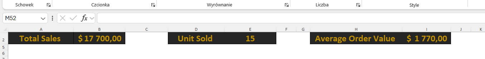
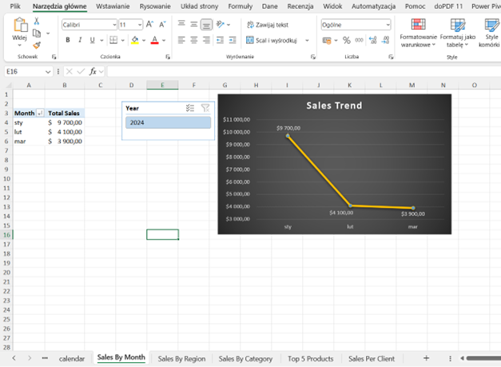
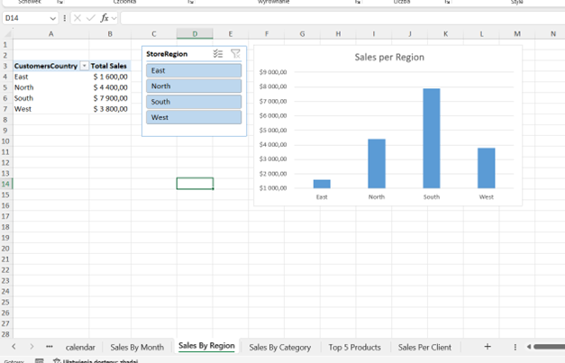
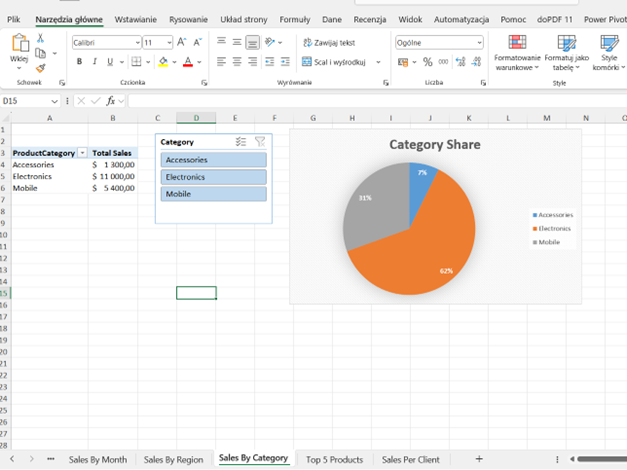
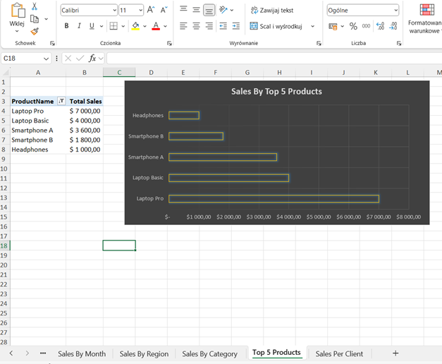
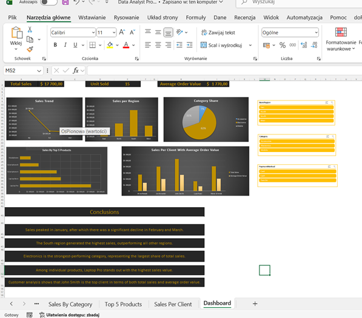

# sales-analysis-excel-powerpivot
Interactive Excel dashboard built using Pivot Tables, Power Pivot, and DAX measures.

# 📊 Excel Sales Analysis Dashboard (Power Pivot + DAX)

A complete end-to-end data analysis project built in **Microsoft Excel**, using:

- Pivot Tables  
- Power Pivot  
- DAX measures  
- Data modeling  
- Interactive dashboard with slicers  

The goal of the project is to analyze sales performance across products, customers, regions, and time.

---

## 📊 Dashboard Preview

### KPI Panel

### Sales Trend

### Sales by Region

### Category Share

### Top 5 Products

### Full Dashboard

## 🔹 **1. Data Cleaning & Preparation**

Imported all CSV files into Excel as structured tables.  
Performed initial data quality checks:

- validated date formats  
- checked for duplicates  
- corrected missing values (e.g., OrderNotes)  
- ensured proper numeric formatting  
- created calculated helper columns:  
  - `Total = Quantity * UnitPrice`  
  - `Month`  
  - `Year`  

---

## 🔹 **2. Data Model (Power Pivot)**

All tables were loaded into **Power Pivot**.

### In the *Calendar* table:
- generated full date range  
- added columns:  
  - Year  
  - Month  
  - MonthName  
  - Quarter  

### Relationships created:
- `Transactions → Customers`  
- `Transactions → Products`  
- `Transactions → Calendar`  

This created a star-schema model suitable for DAX calculations.

---

## 🔹 **3. Pivot Tables & DAX Measures**

Created base pivot tables using key fields:

- Calendar → Month  
- Customers → Country  
- Products → Category  
- Products → ProductName  
- Customers → CustomerName  

### 📐 **DAX Measures created:**

- **Total Sales**
- **Units Sold**
- **Average Order Value (AOV)**
- **Customer Count**
- **Sales YTD**
- **Sales Last Month**
- **Top Product Sales**
- **Sales by Category**
- **Sales by Region**

Example explanation:  
For Top Product Sales, a temporary table (`ProdSales`) was created using `SUMMARIZE` and `CALCULATE`, and `MAXX` was used to extract the highest sales value.

---

## 🔹 **4. Pivot Visualizations & Charts**

Built pivot tables for:

- sales by month  
- sales by region  
- category performance  
- top 5 products  
- sales per customer  

Added slicers:

- Region  
- Category  
- Payment Method  
- Year  

Created visualizations:

- **Sales Trend** (line chart)  
- **Sales by Region** (column chart)  
- **Category Share** (pie chart)  
- **Top 5 Products** (bar chart)  

Some charts intentionally not connected to specific slicers for better clarity (e.g., Category Share).

---

## 🔹 **5. Dashboard Design**

A separate sheet **"Dashboard"** was created containing:

### ✔ KPI tiles:
- Total Sales  
- Units Sold  
- Average Order Value  

KPI formatting techniques used:
- merged cells  
- custom fonts & colors  
- removed gridlines  
- consistent alignment  

### ✔ Visual elements:
- trend chart  
- sales by region chart  
- pie chart  
- top 5 products  
- sales per customer  
- slicers with report connections  

Styling adjustments were made to improve visual clarity and professionalism.

---

## 🔹 **6. Conclusions**

- Sales show a significant decline in **February** and **March** compared to **January** (highest month).  
- The **South** region is the strongest in overall sales.  
- **Electronics** is the best-performing product category.  
- **Laptop Pro** stands out as the top-selling product.  
- The top customer in both total spend and AOV is **John Smith**.

---

## 📁 **Repository Structure**

📦 sales-analysis-excel-powerpivot
│
├── SalesDashboard.xlsx # Full dashboard + pivots + model
├── customers.csv.xlsx # Customer table
├── products.csv.xlsx # Product table
├── transactions.csv.xlsx # Sales transactions
├── calendar.csv.xlsx # Calendar table
│
└── screenshots

---

## 🚀 Future Improvements

- Adding YoY comparisons  
- Building an equivalent dashboard in Power BI  
- Automating data refresh with Power Query  

---

## 👩‍💻 Author

Project created as part of developing data analytics skills in:
- Excel  
- Power Pivot  
- DAX  
- Dashboard design  

LinkedIn: *(www.linkedin.com/in/oskar-warcholiński-0b1806288)*  
GitHub: *(https://github.com/qerty43)*

